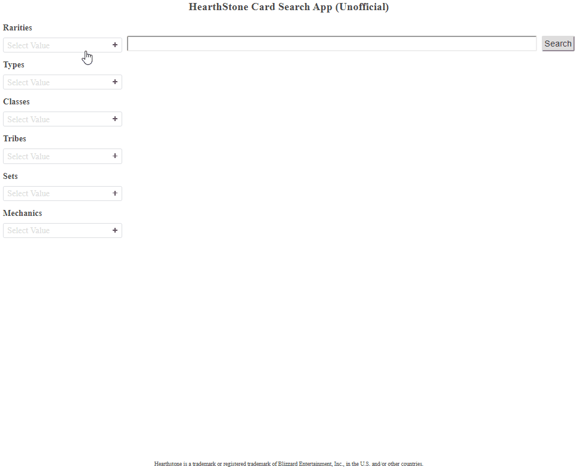

# Hearthstone Card Search App

This Node.js/Express app uses the [HearthstoneJSON API](https://hearthstonejson.com/) and lets you search Hearthstone® cards and filter by multiple classes, sets, types, rarities, tribes, and mechanics.

_[Hearthstone](https://playhearthstone.com) is an online collectible card game by Blizzard and I'm not associated with them but have created this app in accordance to policy in the [Blizzard FAQ](http://us.blizzard.com/en-us/company/about/legal-faq.html)._

## Demo



## Run App in Local Environment

### Initial Setup

Install dependencies:

```
npm install
```

### Build

This should be run initially, and then anytime the client-side JavaScript (`public/js/app.js`) is updated. It will create `bundle.js` in the `public/js` folder. It is needed to make the npm package `slim-select` available to client-side code.

```
npm run build
```

### Run App

Run app in dev mode (uses [nodemon](https://nodemon.io/) to restart server when files change. Press `Ctrl-C` to stop server):

```
npm run dev
```

Run app:

```
npm run start
```

## Update Card Data and Card Sets

### Update Card Data

After a new card expansion comes out (or any time you know of an update being made to cards) run `npm run getCards` to save card data from the HearthstoneJSON API to `data/cards.json`.

If any new card sets have been added to the game that aren't yet in `data/card-sets.json`, a message will be logged to the console with set codes for sets that need to be manually added to it. To manually add a set, you'll need to first [find the full set name](https://playhearthstone.com/en-us/expansions-adventures/) that goes with the set code and then add an item to the array in `data/card-sets.json` (put the set code as the value for "type"):

Example:
```
{"type": "DALARAN",
 "name": "Rise of Shadows",
 "format": "standard"}
  ```

Once any new sets have been manually added, delete `data/card-sets-to-manually-add.json` and rerun `npm run getCards`.

### Update Mechanics

Each new expansion normally adds some cards featuring new mechanics. To add any new mechanics to the "Mechanics" filter, add the new mechanic to the array in `data/mechanics-list.json`.

Example:
```
  {"type": "TWINSPELL",
   "name": "Twinspell"}
```
Note that `"type"` is what the API calls the mechanic, and name is the name to display in the filter. Sometimes, unfortunately the name the API gives it isn't the correct name, for instance it calls the Magnetic mechanic "Modular". 

You can get a list of mechanics by running `npm run updateMechanics` which will put all unique mechanics from cards in `data/cards.json` in `mechanics-list-raw.json` and you could look through that file to figure it out. Note that I don't use all the mechanics in that file in the filter (See comment at the top of `mechanics-list-raw.json` for more info.)

### Update Tribes

When and if a new tribe (ie. dragon, murloc, mech, etc) is added to cards, run `npm run updateTribes` to update the tribes that you can filter by.

## Browser Compatibility

IE is not currently supported.

Known issues with IE:

* Inputs on the sidebar do not work. The `form` attribute is used to associate inputs outside of the search form with the form. To add support for IE, either research and find an HTML 5 polyfill that supports the form attribute, or refactor to use hidden inputs in the search form that get updated with data from the sidebar inputs when the form is submitted. 

## Technologies Used

* JavaScript
* [Node.js](https://nodejs.org)
* [Express](https://expressjs.com/)
* [HearthstoneJSON API](https://hearthstonejson.com/)

## License

Code is licensed under the MIT License. 

Note that if you use Blizzard trademarks in association with the code, it's up to you to follow their policies.

## Trademark Info

Hearthstone is a trademark or registered trademark of Blizzard Entertainment, Inc., in the U.S. and/or other countries.
